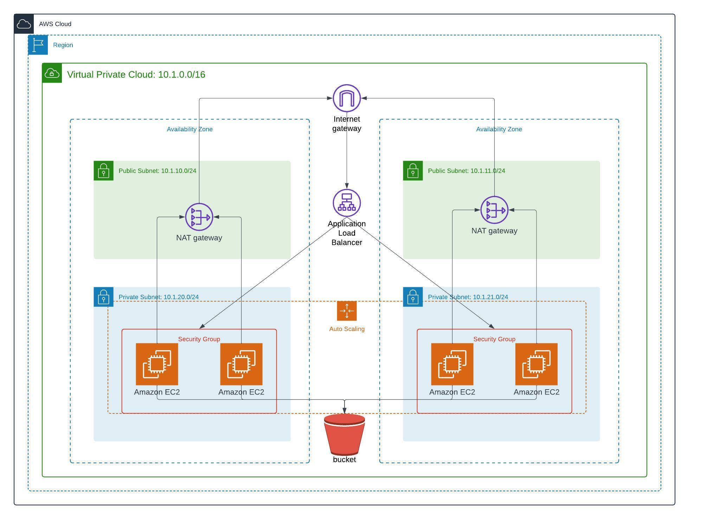

# CD12352 - Infrastructure as Code Project Solution
# [dpt1305]

## Spin up instructions

## Tear down instructions
### Provision project
0. Provide execution permission for bash script:
    > chmod -x ./run-network.sh

    > chmod -x ./run-udagram.sh

    > chmod -x ./delete-resources.sh

1. Create network infrastructure:
    > ./run-network.sh

2. Create udagram infrastructure:
    > ./run-udagram.sh

3. Remove resources:
    > ./delete-resources.sh
### Network
- Create network resources:

    [x] VPC

    [x] Subnets

    [x] Route Table

    [x] InternetGateway
 
### Udagram
- Create resources:

    [x] Security Group for LoadBalancer and EC2 instances
    
    [x] Launch Template 
    
    [x] Autoscaling group
    
    [x] Load Balancer
    
    [x] S3 bucket

## Other considerations
TODO (optional)